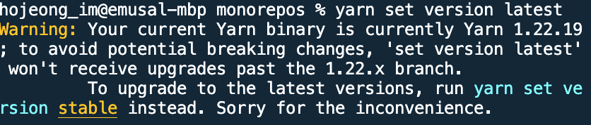

### Error

- 직접 하나씩 해 보면서 발생한 오류들 

1. yarn set version latest 했을 때 최신 버전이 적용되지 않을 때 

  - yarn set version stable을 사용한다 

2. yarn dlx @yarnpkg/sdks vscode 사용 시 에러 

  - 'This tool can only be used with projects using Yarn Plug'n'Play' error 발생 

  - yarn 명령어를 실행시켜서 .pnp.cjs를 만들어주고 실행해보자 

